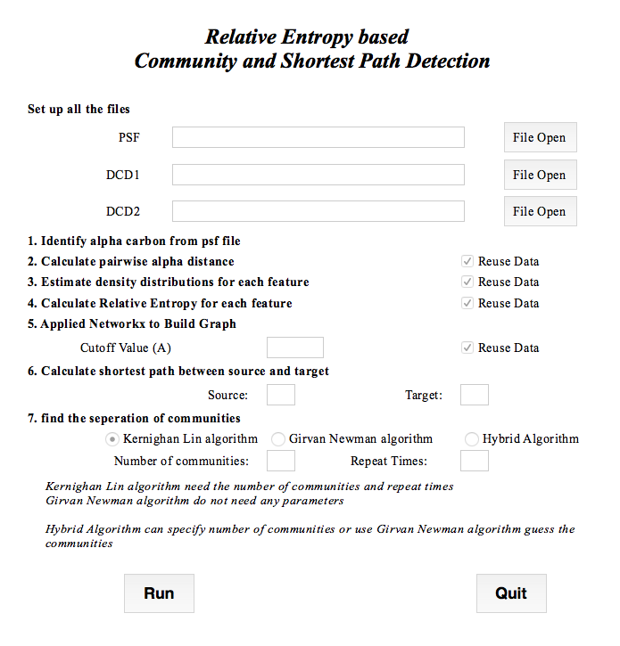

# Relative_Entropy
Calculate Kullback–Leibler divergence for Molecular Dynamics Simulations for any two pertubed simulations with the relevant k shortest paths and communities detection analysis.

## Goal:
1. Identify the several shortest paths that can propagate the local distribution differences into global distribution changes in two simulations.  
2. Identify several communities that inside the communities are less effected by external perturbations, and inter-communities are strongly effected by the external perturbations. 

## Cmd_main  
### Commnad line interface  
Need 3 arguments ./cmd_main.py psf_file dcd1_file dcd2_file.    
Implemented yen k shortests path algorithm and Kernighan–Lin algorithm, Girvan–Newman algorithm and a hybrid algorithm to identify communities.    

------
./cmd_main.py pdz2_segida.psf 3lnx.dcd 3lny.dcd

stdout on screen.   

	1. Identify alpha carbon from psf file.    
	
	2. Calculate pairwise alpha distance.  
		Find alpha distance file.  

	3. Estimate density distributions for each feature . 
		Find density distributions file.   

	4. Calculate Relative Entropy for each residue.  
		Find Relative Entropy file.  

	5. Build Graph.  
		 Find Graph Pickle file.  

	6. Calculate shortest path between source and target.  
		 Skip or not (default skip) -->  

	7. find the seperation of communities   
		 Select Algorithm    
			 1. Kernighan–Lin algorithm   
			 2. Girvan–Newman algorithm   
			 3. Hybrid Algorithm (Use GirvanNewman for initial guess, then use KL to approach minimum) -->   
------

## GUI_main
(Need install tkinter)  
./gui_main.py   

A simple Graphic User Interface for uploading files and setting parameters  
  

